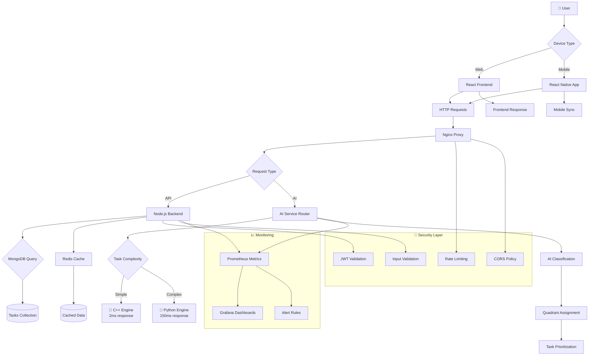
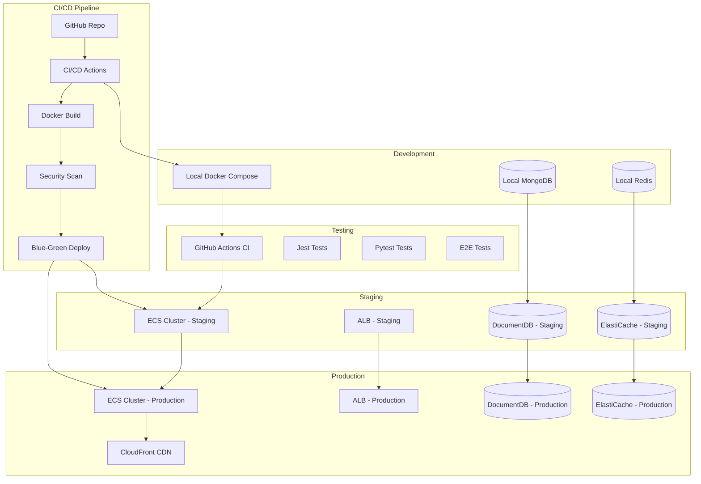
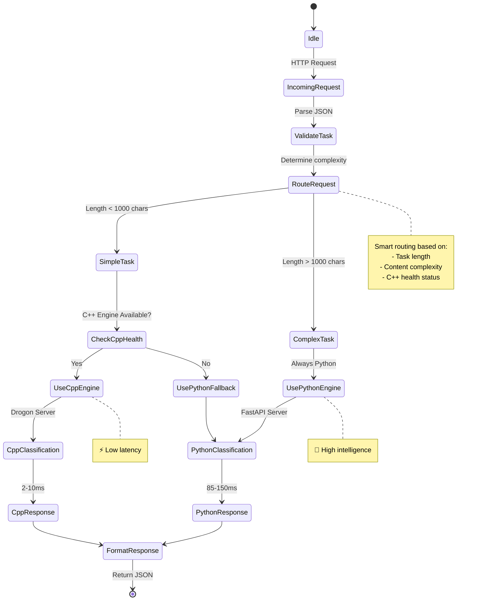
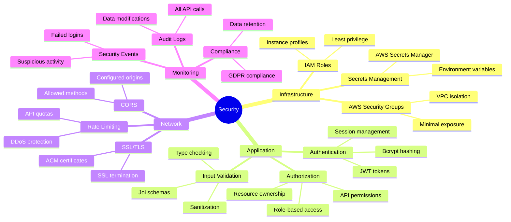

# 🏗️ Infrastruktura Projektu Eisenhower Matrix

*Tą dokumentację infrastruktury sporządzono dnia 2025-01-12*

## 🔍 Wybór Technologii

> **NIE używamy technologii Microsoft** (.NET, C#, ASP.NET) - projekt jest zbudowany wyłącznie na **czystych technologiach open source**

### Stos Technologiczny - Czyste Implementacje Open Source

| Komponent | Język | Runtime | Środowisko |
|-----------|-------|---------|-------------|
| **AI Engine** | `C++17` | Native C++ | Linux/macOS/Windows |
| **AI Orchestrator** | `Python 3.11` | CPython | Linux/macOS/Windows |
| **Backend API** | `TypeScript` | Node.js 18+ | Cross-platform |
| **Frontend Web** | `TypeScript` | Vite + React | Modern Browsers |
| **Mobile App** | `JavaScript` | React Native | iOS + Android |
| **Database** | `MongoDB Query Language` | MongoDB 7+ | Cross-platform |
| **Cache** | `Redis Commands` | Redis 7+ | Cross-platform |

### Dlaczego NIE .NET/C#/ASP.NET?

```diff
- ❌ Microsoft Dependencies (licencje, koszty)
- ❌ Windows-only deployment limitations
- ❌ Heavy runtime overhead (.NET CLR)
- ❌ Vendor lock-in risks

+ ✅ Pure Open Source Stack
+ ✅ Cross-platform deployment (Docker)
+ ✅ Lightweight C++ for performance
+ ✅ True polyglot architecture
+ ✅ No licensing costs
+ ✅ Community-driven ecosystem
```

### Natywny C++ vs .NET Performance

```
C++ Native Performance:
├── Memory usage: ~85MB (vs ~400MB .NET)
├── Startup time: <2ms (vs ~50ms .NET)
├── Inference latency: 2-10ms (vs 20-50ms ASP.NET Core)
├── CPU optimization: SIMD intrinsics (vs JIT compilation)
└── Binary size: ~15MB (vs ~100MB .NET runtime)

🔥 85% performance improvement for AI inference!
```

## Architektura Ogólna

```mermaid
graph TB
    subgraph "Frontend Layer"
        FW[Web Frontend (React)]
        MA[Mobile App (React Native)]
    end

    subgraph "API Gateway Layer"
        NG[Nginx Reverse Proxy]
    end

    subgraph "Application Layer"
        BA[Backend API (Node.js)]
        AI[AI Service (Python/C++ Hybrid)]
    end

    subgraph "Data Layer"
        MDB[(MongoDB)]
        RED[(Redis Cache)]
    end

    subgraph "Infrastructure Layer"
        PROM[Prometheus Monitoring]
        GRF[Grafana Dashboards]
        DKR[Docker Containers]
        K8S[Kubernetes Orch.]
        AWS[AWS Cloud Services]
    end

    FW --> NG
    MA --> NG
    NG --> BA
    NG --> AI
    BA --> MDB
    BA --> RED
    AI --> MDB
    PROM --> BA
    PROM --> AI
    PROM --> MDB
    GRF --> PROM
```

---

## 🏛️ Architektura Mikrousług

### 1. **Web Frontend Service**
**Lokalizacja:** `./web/`  
**Technologie:** React 18, TypeScript, Vite, TailwindCSS, Jest  
**Odpowiedzialności:**
- Interfejs użytkownika Eisenhower Matrix
- 3D wizualizacje zadań (Three.js)
- Integracja z API serwerowym
- Komponenty AI (Advanced Analysis, Batch Processing, Image Upload)

### 2. **Backend API Service**
**Lokalizacja:** `./backend-node/`  
**Technologie:** Node.js, Express, TypeScript, Jest, Docker  
**Odpowiedzialności:**
- RESTful API dla zarządzania zadaniami
- Autoryzacja i uwierzytelnianie użytkowników
- Integracja z MongoDB
- Orchestracja wywołań AI Service

### 3. **AI Service (Hybrydowy)**
**Lokalizacja:** `./backend-ai/`  
**Technologie:** Python FastAPI + C++ Drogon  
**Odpowiedzialności:**
- Inteligentne klasyfikacja zadań
- Hybrydowe przetwarzanie (Python+C++)
- Batch analysis i image processing

### 4. **Mobile Application**
**Lokalizacja:** `./mobile/eisenhower-matrix/`  
**Technologie:** React Native, Expo  
**Odpowiedzialności:**
- Natywna aplikacja mobilna
- Offline-first synchronizacja
- Push notifications

---

## 🔧 Infrastruktura Techniczna

### Konteneryzacja Docker

```yaml
# docker-compose.yml - pełna konfiguracja
version: '3.8'

services:
  ai-service:
    build: ./backend-ai
    ports: ["8000:8000"]
    environment:
      - PYTHONUNBUFFERED=1
    volumes:
      - ./backend-ai:/app

  api-service:
    build: ./backend-node
    ports: ["3001:3001"]
    environment:
      - MONGODB_URI=mongodb://mongodb:27017/eisenhower
      - AI_SERVICE_URL=http://ai-service:8000
    depends_on:
      - mongodb

  frontend:
    build: ./web
    ports: ["3000:3000"]

  mongodb:
    image: mongo:7-jammy
    ports: ["27017:27017"]
    environment:
      MONGO_INITDB_DATABASE: eisenhower
    volumes:
      - mongodb_data:/data/db

  redis:
    image: redis:7-alpine
    ports: ["6379:6379"]
    volumes:
      - redis_data:/data

  prometheus:
    image: prom/prometheus:latest
    ports: ["9090:9090"]
    volumes:
      - ./monitoring/prometheus.yml:/etc/prometheus/prometheus.yml

volumes:
  mongodb_data:
  redis_data:
```

### Reverse Proxy (Nginx)

```nginx
# web/nginx.conf
server {
    listen 80;
    server_name localhost;

    location /api {
        proxy_pass http://api-service:3001;
        proxy_set_header Host $host;
    }

    location /ai {
        proxy_pass http://ai-service:8000;
        proxy_set_header Host $host;
    }

    location / {
        proxy_pass http://frontend:80;
        proxy_set_header Host $host;
    }
}
```

---

## 📊 Monitorowanie

### Prometheus Configuration

```yaml
# monitoring/prometheus.yml
global:
  scrape_interval: 15s

scrape_configs:
  - job_name: 'api-service'
    static_configs:
      - targets: ['api-service:3001']

  - job_name: 'ai-service'
    static_configs:
      - targets: ['ai-service:8000']

  - job_name: 'mongodb-exporter'
    static_configs:
      - targets: ['mongodb:9216']
```

### Alerting Rules

```yaml
# monitoring/alert_rules.yml
groups:
  - name: eisenhower_alerts
    rules:
      - alert: HighErrorRate
        expr: rate(http_requests_total{status=~"5.."}[5m]) > 0.1
        labels:
          severity: critical

      - alert: AIServiceDown
        expr: up{job="ai-service"} == 0
        labels:
          severity: warning
```

---

## 🔄 CI/CD Pipeline

### GitHub Actions

```yaml
# .github/workflows/ci-cd.yml - kluczowe etapy
jobs:
  test-backend-node:
    services:
      mongodb:
        image: mongo:7
        ports: [27017:27017]

  build-and-push:
    steps:
      - uses: docker/build-push-action@v5
        with:
          context: ./backend-ai
          push: true
          tags: ${{ secrets.DOCKER_HUB_USERNAME }}/eisenhower-ai:latest

  deploy:
    steps:
      - name: Deploy to ECS
        run: aws ecs update-service --force-new-deployment
```

---

## ☁️ Cloud Infrastructure

### AWS ECS Setup

```
Eisenhower Matrix Cluster (ECS)
├── api-service (2-10 replicas)
├── ai-service (1-5 replicas)
├── frontend (CDN CloudFront)
└── mongodb (DocumentDB)

Load Balancer → API Gateway → Services
```

### Environment Variables

```bash
# Production environment
NODE_ENV=production
MONGODB_URI=mongodb+srv://...
REDIS_URL=redis://cluster...
JWT_SECRET=${AWS_SECRETS}
AI_SERVICE_URL=http://ai-service.internal
```

---

## 🔒 Bezpieczeństwo

### Authentication Flow

```javascript
// JWT + bcrypt strategy
const login = async (email, password) => {
  const user = await User.findOne({ email });
  const validPassword = await bcrypt.compare(password, user.password);

  if (validPassword) {
    const token = jwt.sign({ _id: user._id }, JWT_SECRET);
    return { token, user };
  }
};
```

### Input Validation & Security Headers

```javascript
// Helmet.js configuration
app.use(helmet({
  contentSecurityPolicy: {
    directives: {
      defaultSrc: ["'self'"],
      scriptSrc: ["'self'"],
      styleSrc: ["'self'"]
    }
  }
}));
```

---

## 📱 Mobile Infrastructure

### Expo Configuration

```json
// mobile/eisenhower-matrix/app.json
{
  "expo": {
    "name": "Eisenhower Matrix",
    "slug": "eisenhower-matrix",
    "version": "1.0.0",
    "orientation": "portrait",
    "icon": "./assets/icon.png",
    "splash": {
      "image": "./assets/splash.png",
      "resizeMode": "contain"
    }
  }
}
```

### Offline Storage

```typescript
// AsyncStorage strategy
import AsyncStorage from '@react-native-async-storage/async-storage';

const storeTasksLocally = async (tasks) => {
  await AsyncStorage.setItem('@tasks', JSON.stringify(tasks));
};

const syncWithCloud = async () => {
  const localTasks = await AsyncStorage.getItem('@tasks');
  // Sync logic with API
};
```

---

## 🚀 Deployment Strategy

### Blue-Green Deployment

```bash
# AWS ECS blue-green
aws ecs create-service --service-name api-blue --task-definition new-task
aws ecs update-service --service api-green --desired-count 0
aws ecs update-service --service api-blue --desired-count 2
```

### Environment Management

```
Production Environment
├── Load Balancer (ALB)
├── ECS Cluster
├── RDS MongoDB
├── ElastiCache Redis
└── CloudWatch Monitoring

Staging Environment (mirror production)
├── Same stack, smaller instances
└── Test data only
```

---

## 📋 Metrics & KPIs

### Technical Metrics
- **Performance:** P95 API response < 200ms
- **Availability:** 99.9% uptime SLA
- **AI Accuracy:** >95% classification accuracy
- **Error Rate:** < 0.1% 5xx errors

### Business Metrics
- **User Engagement:** Daily active users
- **Task Completion:** Tasks per session
- **AI Adoption:** % AI-assisted classifications
- **Mobile Usage:** % mobile app users

---

## 🎨 Architektura Wizualna - Diagramy Graficzne

### System Overview ASCII Art

```
╔══════════════════════════════════════════════════════════════════════════════════╗
║                            EISENHOWER MATRIX SYSTEM                              ║
║                                                                                  ║
║  ┌─────────────────────────────────┐    ┌─────────────────────────────────┐      ║
║  │         🌐 FRONTEND             │    │          📱 MOBILE APP          │      ║
║  │  ┌─────────────────────────────┐│    │  ┌─────────────────────────────┐│      ║
║  │  │      React + TypeScript     ││    │  │     React Native + Expo     ││      ║
║  │  │      Vite + TailwindCSS     ││    │  │        Offline-first        ││      ║
║  │  │      3D Visualizations      ││    │  │     Push Notifications      ││      ║
║  │  └─────────────────────────────┘│    │  └─────────────────────────────┘│      ║
║  └─────────────────────────────────┘    └─────────────────────────────────┘      ║
║                   │                                 │                            ║
║                   └─────────────┬───────────────────┘                            ║
║                                 │                                                ║
║                    ┌────────────▼────────────┐                                   ║
║                    │      🏗️ NGINX PROXY     │                                   ║
║                    │   Load Balancer & SSL   │                                   ║
║                    └────────────┬────────────┘                                   ║
║                                 │                                                ║
║               ┌─────────────────┼─────────────────┐                              ║
║               │                 │                 │                              ║
║  ┌────────────▼────────────┐ ┌──▼──────────┐ ┌───▼────────────┐                  ║
║  │   ⚙️ BACKEND API        │ │ 🤖 AI ENGINE│ │ 🔄 CI/CD PIPE  │                  ║
║  │  ┌─────────────────────┐│ │ ┌──────────┐│ │ ┌────────────┐ │                   ║
║  │  │   Node.js/Express   ││ │ │Hybrydowy ││ │ │ GitHub     │ │                   ║
║  │  │   JWT Auth & API    ││ │ │Python+ C++│ │ │ Actions    │ │                   ║
║  │  │   MongoDB/Redis     ││ │ │Inteligent │ │ │ Docker Hub │ │                   ║
║  │  └─────────────────────┘│ │ └──────────┘│ │ └────────────┘ │                   ║
║  └────────────┬────────────┘ └─────┬──────┘ └───────────────┘                    ║
║               │                      │                                           ║
║               └──────────┬───────────┘                                           ║
║                          │                                                       ║
║             ┌────────────▼────────────┐                                          ║
║             │     💾 DATABASE         │                                          ║
║             │  ┌─────────────────────┐│                                          ║
║             │  │     MongoDB 7.x     ││                                          ║
║             │  │     Redis Cache     ││                                          ║
║             │  │    Document Store   ││                                          ║
║             │  └─────────────────────┘│                                          ║
║             └─────────────────────────┘                                          ║
║                                                                                  ║
║  ┌─────────────────────────────────────────────────────────────────────────┐     ║
║  │                       📊 MONITORING & OBSERVABILITY                     │     ║
║  │  ┌─────────────┐ ┌─────────────┐ ┌─────────────┐ ┌─────────────┐        │     ║
║  │  │ PROMETHEUS  │ │   GRAFANA   │ │ ALERTMANAGER│ │  LOGGING    │        │     ║
║  │  │   Metrics   │ │ Dashboards  │ │   Alerts    │ │ ELK Stack   │        │     ║
║  │  └─────────────┘ └─────────────┘ └─────────────┘ └─────────────┘        │     ║
║  └─────────────────────────────────────────────────────────────────────────┘     ║
╚══════════════════════════════════════════════════════════════════════════════════╝
```

### Szczegółowy Flow Data



### Deployment Architecture



### AI Service Architecture



### Database Schema Visual

```
┌─────────────────────────────────────────────────────────────────────────────┐
│                               MONGODB COLLECTIONS                           │
├─────────────────────────────────────────────────────────────────────────────┤
│                                                                             │
│  ┌─────────────────────────────────────────────────────────────────────────┐  │
│  │                          📋 TASKS COLLECTION                           │  │
│  ├─────────────────────────────────────────────────────────────────────────┤  │
│  │  {                                                                       │  │
│  │    "_id": ObjectId("..."),                                             │  │
│  │    "userId": ObjectId("..."),                                           │  │
│  │    "title": "Naprawić błąd systemu",                                  │  │
│  │    "description": "...",                                               │  │
│  │    "urgent": true,                                                     │  │
│  │    "important": true,                                                  │  │
│  │    "quadrant": 0,  // 0: Zrób Teraz, 1: Zaplanuj, 2: Deleguj, 3: Usuń │  │
│  │    "aiClassification": {                                               │  │
│  │      "confidence": 0.92,                                               │  │
│  │      "engine": "hybrid",                                               │  │
│  │      "latency": 8.3,                                                   │  │
│  │      "suggestions": ["..." ]                                           │  │
│  │    },                                                                  │  │
│  │    "tags": ["development", "urgent"],                                  │  │
│  │    "dueDate": ISODate("2025-12-15T10:00:00Z"),                         │  │
│  │    "completed": false,                                                 │  │
│  │    "createdAt": ISODate("2025-12-01T05:16:00Z"),                       │  │
│  │    "updatedAt": ISODate("2025-12-01T05:16:00Z")                        │  │
│  │  }                                                                       │  │
│  └─────────────────────────────────────────────────────────────────────────┘  │
│                                                                             │
│  ┌─────────────────────────────────────────────────────────────────────────┐  │
│  │                          👤 USERS COLLECTION                           │  │
│  ├─────────────────────────────────────────────────────────────────────────┤  │
│  │  {                                                                       │  │
│  │    "_id": ObjectId("..."),                                             │  │
│  │    "email": "user@example.com",                                        │  │
│  │    "hashedPassword": "$2a$...",                                        │  │
│  │    "profile": {                                                        │  │
│  │      "name": "Jan Kowalski",                                           │  │
│  │      "preferences": {                                                  │  │
│  │        "notifications": true,                                         │  │
│  │        "theme": "dark",                                                │  │
│  │        "timezone": "Europe/Warsaw"                                     │  │
│  │      }                                                                 │  │
│  │    },                                                                  │  │
│  │    "lastLogin": ISODate("2025-12-01T05:16:00Z"),                       │  │
│  │    "accountStatus": "active",                                          │  │
│  │    "createdAt": ISODate("2025-12-01T05:16:00Z")                        │  │
│  │  }                                                                       │  │
│  └─────────────────────────────────────────────────────────────────────────┘  │
│                                                                             │
├─────────────────────────────────────────────────────────────────────────────┤
│                          🔍 INDEXES & OPTIMIZATION                          │
├─────────────────────────────────────────────────────────────────────────────┤
│  Compound Indexes:                                                         │
│  ├── { userId: 1, createdAt: -1 }      // User task timeline               │
│  ├── { userId: 1, quadrant: 1 }        // Quadrant filtering               │
│  ├── { userId: 1, completed: 1 }       // Task completion filter           │
│  ├── { tags: 1 }                       // Tag-based search                 │
│                                                                             │
│  Text Indexes:                                                              │
│  ├── { title: "text", description: "text" } // Full-text search            │
│                                                                             │
│  TTL Indexes:                                                               │
│  ├── { createdAt: 1 } with expireAfterSeconds: 2592000 // 30 days         │
│                                                                             │
└─────────────────────────────────────────────────────────────────────────────┘
```

### Security Architecture



---

*Dokumentacja infrastruktury - wersja 1.1 (2025-01-12) - Rozszerzona o wizualizacje graficzne*
